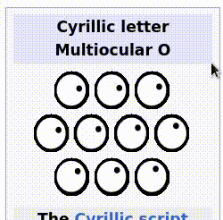

biblically accurate xeyes
-------------------------

At last, comprehensive Cyrillic support for xeyes(1).

Invoke as 

    xeyes -multiocular 7      (Unicode pre-15)

or

    xeyes -multiocular 10     (Unicode 15.0 or later)

(Or you can configure with an X resource, if that's your kink.)

You don't even need to tussle with `Imake` to build this
(eyeronically).

Original README follows:

---

xeyes - a follow the mouse X demo, using the X SHAPE extension
--------------------------------------------------------------

All questions regarding this software should be directed at the
Xorg mailing list:

  https://lists.x.org/mailman/listinfo/xorg

The primary development code repository can be found at:

  https://gitlab.freedesktop.org/xorg/app/xeyes

Please submit bug reports and requests to merge patches there.

For patch submission instructions, see:

  https://www.x.org/wiki/Development/Documentation/SubmittingPatches

